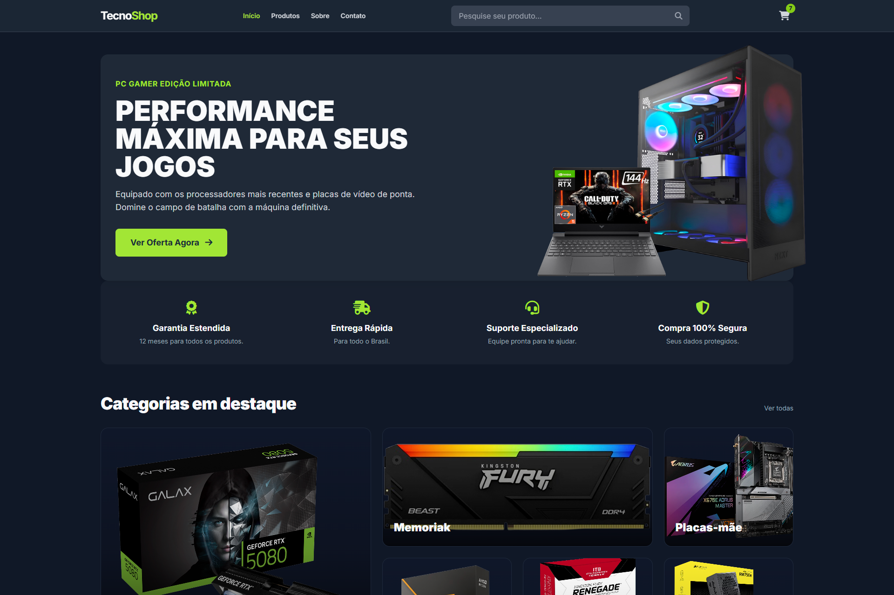
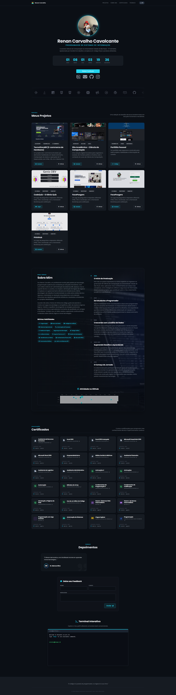
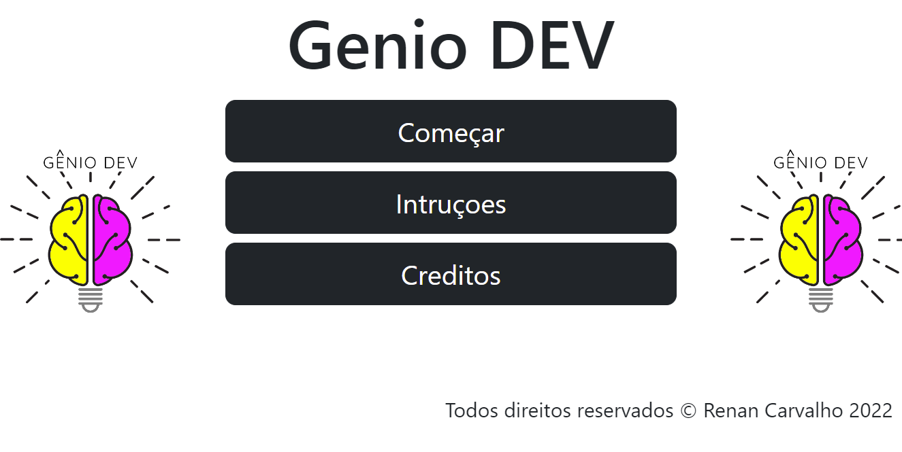

## Oi 👋! Eu sou Renan Carvalho 🧑‍💻

💻 **Programador Full Stack** | 🎓 **Ciência da Computação - 4º semestre**  
🔧 Experiência em ERP, automação e desenvolvimento web  
🚀 Apaixonado por tecnologia, desafios e inovação  
🔍 Sempre em busca de aprendizado e evolução constante  

Sou um profissional dedicado e apaixonado por tecnologia, nascido em 2004 e residente na Zona Leste, SP. Atualmente, curso Ciência da Computação na Universidade Cidade de São Paulo (previsão de conclusão: dezembro de 2028) e atuo como **Programador de Sistemas de Informação** na empresa **Mundo dos Computadores**.  
Minha experiência inclui o desenvolvimento, manutenção e otimização do sistema **Tiny ERP**, colaborando com equipes multidisciplinares para implementar soluções inovadoras e eficientes.

Ao longo da minha trajetória, realizei diversos cursos – de **Excel Avançado** e **Power BI** a **Fundamentos de Programação** e **Automação** – que complementam minha formação técnica e me preparam para desafios em cargos como **Estagiário em TI**, **Desenvolvedor Web Júnior** e outras oportunidades no setor.

🔗 Confira meus projetos e portfólio completo:

---

## 🛠️ Ferramentas e Tecnologias

---

## 🚀 Projetos em Destaque
<table>
<tr>
<td width="50%">
<h3 align="center">TecnoStoreBR (Plataforma de E-commerce de Hardware)</h3>

Um projeto de e-commerce simulado que demonstra habilidades em desenvolvimento, manipulação de dados e operações de TI. Desenvolvido com HTML, CSS, JS e Tailwind CSS.
 
<a href="https://renanratinh0.github.io/TecnoStoreBR/index.html">🔗 Acesse o Projeto</a> <a href="https://github.com/renanratinh0/TecnoStoreBR">🚀 Veja no GitHub</a>

</td>
<td width="50%">
<h3 align="center">Site de Conteúdo Acadêmico - Ciência da Computação</h3>

Uma solução digital inovadora para organizar e acessar, de maneira prática e intuitiva, todo o conteúdo do curso de Ciência da Computação.
 
<a href="https://dashboard-quantum-smart.notion.site/b7bf990f0be94291b9f6b01359a8e00a?v=6fdd751eb7624d248c2f8b26b52d6687">🔗 Acesse o Projeto</a>

</td>
</tr>
<tr>
<td width="50%">
<h3 align="center">Portfólio Pessoal</h3>

Um portfólio web responsivo construído para exibir projetos, habilidades e informações de contato.
 
<a href="https://renanratinh0.github.io/renanratinh0/index.html">🔗 Acesse o Projeto</a> <a href="https://github.com/renanratinh0/renanratinh0">🚀 Veja no GitHub</a>

</td>
<td width="50%">
<h3 align="center">CodeQuiz - O Gênio Quiz da Programação</h3>

Um jogo de perguntas e respostas utilizando HTML, CSS e JavaScript, com o framework Bootstrap para estilização.
 
<a href="https://renanratinh0.github.io/CodeQuiz/index.html">🔗 Acesse o Projeto</a> <a href="https://github.com/renanratinh0/CodeQuiz">🚀 Veja no GitHub</a>

</td>
</tr>
</table>

---

## 🖥️ Workspace Specs

### 🎮 **PC Gamer**

### 💻 **Notebook**

---

## 📊 Estatísticas do GitHub

 

---

## 🌐 Contatos

